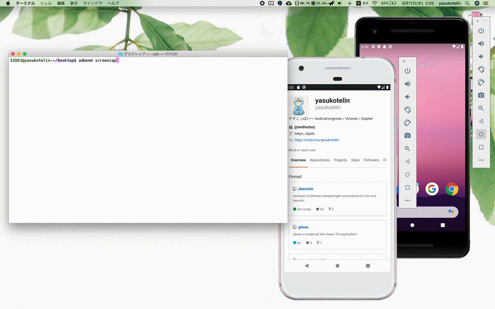

# adbeem


adbeem is a CLI tool to capture or record the screen of Android with adb.



## Requirement

- [adb](https://developer.android.com/studio/command-line/adb)
- [go](https://golang.org/doc/install) >= 13

If you use to convert to gif from mp4 screen capture.
- ffmpeg

## Features

- Easy capture screen（JPEG, PNG）
- Easy record screen（MP4）
- Device connected to the PC.
- Emulator
- Multi devices. You can select a device with prompt ui.

## Install

You need to install [adb](https://developer.android.com/studio/command-line/adb) before install adbeem.

If you use to convert to gif from mp4 screen capture, you need to install ffmpeg.

And you can install adbeem with go get.

```
go get github.com/yasukotelin/adbeem
```

## Usage

Show help.

```
$ adbeem
NAME:
   adbeem - adbeem is a CLI tool to capture or record the screen of Android with adb

USAGE:
   adbeem [global options] command [command options] [arguments...]

VERSION:
   0.1.0

COMMANDS:
   screencap     capture screen
   screenrecord  records screen
   help, h       Shows a list of commands or help for one command

GLOBAL OPTIONS:
   --help, -h     show help (default: false)
   --version, -v  print the version (default: false)
```

### screencap

```
adbeem screencap
```

If you use --output (or -o), you can specify output path.<br>
Default output path is current directory and like this format `adbeem-20200611010217.png`.

```
adbeem screencap -o ~/Desktop/output.png
```

### screenrecord

Records the screen on device.(Max 3 minute)

```
adbeem screenrecord
```

screenrecord command can also use --output flag.

```
adbeem screenrecord -o ~/Desctop/demo.mp4
```

#### Convert to gif

If you want gif, you can use --gif(-g) option.

```
adbeem screenrecord -g
```

adbeem outputs mp4 and gif file.

--gifrate(-gr), gif framerate option.

```
abdeem screenrecord -g -gr 30
```

default is 15 framerate.

## Author

yasukotelin
